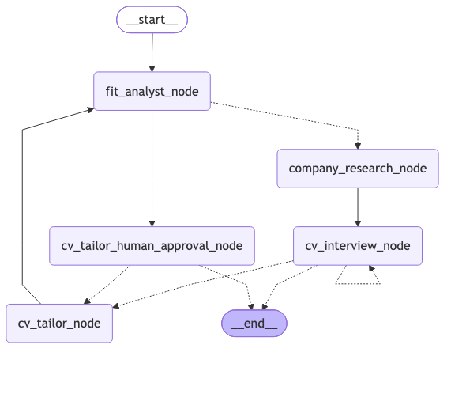

# ApplyPilot

AI-assisted job application workflow built around a **custom LangGraph StateGraph**.

Upload a job offer URL + your master CV (DOCX). The system:
1. Analyzes fit between CV and offer
2. Researches the company
3. Runs a **human-in-the-loop interview** to clarify gaps and preferences
4. Tailors CV content **without inventing experience**
5. Asks for final approval
6. Exports an updated DOCX

> Core idea: LangGraph models the **decision process**.  
> Fetching, parsing, and file export stay **outside** the graph.

---

## Why this project

Most “AI apply” demos either:
- rewrite CVs aggressively (and hallucinate), or
- hide the whole flow inside one autonomous agent

ApplyPilot does the opposite:
- explicit graph with clear stages
- HITL gates and an interview stage
- strict **no fabricated experience** rule
- thin FastAPI API

---

## Architecture

### Outside the graph (services)
- `fetch_job` – URL → cleaned text (with fallback to pasted text)
- `parse_offer` – cleaned text → `StructuredOffer`
- `parse_cv` – DOCX text → `StructuredCV`
- `apply_cv_edits` – apply tailored content back to DOCX

### Inside the graph (decisions / AI / HITL)
1. **fit_analyst** – score, gaps, rationale, recommendation
2. **company_research** – sub-agent style research → product / outsourcing / unknown
3. **cv_interview** – chat with the candidate, collects `Clarifications`
4. **cv_tailor** – updates summary / skills / bullets using clarifications
5. **cv_approval** – human approve / reject / request changes
6. **export** – only after approval (API service, not a graph node)

```text
START
  → fit_analyst
  → company_research
  → cv_interview          (interrupt per chat turn)
  → cv_tailor
  → cv_approval           (HITL)
  → END (ready_for_export)
```



---

## Key design decisions

| Decision | Why |
|----------|-----|
| Custom `StateGraph` instead of one big agent | Clear control flow, easier to reason about and demo |
| Interview before tailoring | Score only improves when the candidate confirms real experience |
| `Clarifications` as structured output | Tailor must not invent jobs/dates/skills |
| Export outside the graph | File I/O is not a decision step |
| No auto-send emails | Human must approve outreach artifacts |

---

## API

Base URL: `http://localhost:8000`

| Method | Endpoint | Purpose |
|--------|----------|---------|
| `POST` | `/applications` | Start flow (offer URL + CV DOCX) |
| `GET` | `/applications/{id}` | Current state / payload for UI |
| `POST` | `/applications/{id}/messages` | Interview chat message (resume) |
| `POST` | `/applications/{id}/decision` | CV approval decision (`resume` / `exit` / `feedback`) |
| `GET` | `/applications/{id}/cv` | Download tailored DOCX |
| `GET` | `/health` | Health check |

### Typical flow

1. `POST /applications` → fit + research + first interview question
2. `POST /applications/{id}/messages` until interview completes
3. System tailors CV
4. `POST /applications/{id}/decision` to approve / reject / request changes
5. `GET /applications/{id}/cv` when status is ready for export

The client should render from:
- `status`
- `interrupted`
- `allowed_actions`
- `payload` (fit, company, interview messages, tailored CV)

---

## Tech stack

- **Python** – FastAPI, LangGraph, LangChain, pydantic
- **LLM** – configurable (OpenAI / compatible)
- **CV** – DOCX master → structured edit → export
- **Persistence** – LangGraph checkpointer for interrupt/resume

---

## Running locally

```bash
# create venv, install deps
cp .env.example .env   # set LLM keys
uv run main.py
uv run api
```

> Adjust module path to your package layout if needed.

---

## Demo video

[UI walkthrough](https://youtu.be/vbnqi90kgkk)
